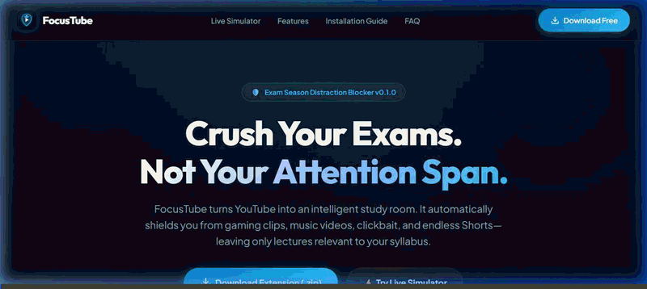
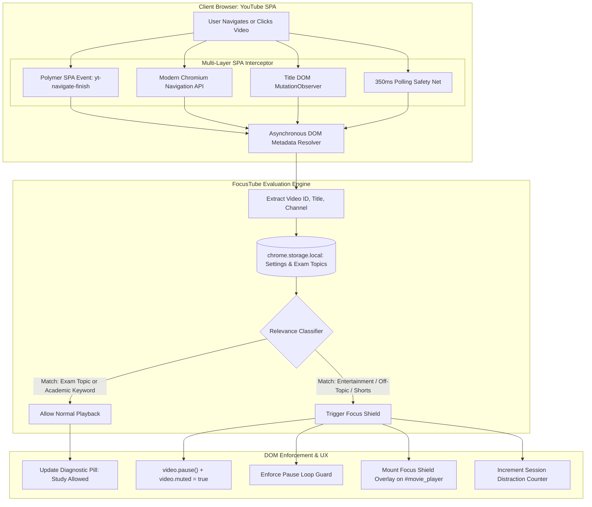

<div align="center">

# 🎓 FocusTube

### Intelligent Distraction-Control & Study Mode for YouTube
**Engineered for High-Stakes Exam Revision & Focused Academic Learning**

[](https://developer.chrome.com/docs/extensions/mv3/intro/)
[](https://developer.mozilla.org/en-US/docs/Web/JavaScript)
[](#privacy--zero-telemetry-architecture)
[](LICENSE)
[](https://nayanika530.github.io/focustube/)

<br />



<br />
<br />

**[🌐 Live Companion & Download Portal](https://nayanika530.github.io/focustube/)** • **[⚡ Quickstart Guide](#-quickstart-for-reviewers-30-second-setup)** • **[📐 System Architecture](#-system-architecture--engineering-deep-dive)** • **[💡 Design Rationale](#-why-its-built-this-way-technical-decisions--trade-offs)**

---

</div>

## 📌 Executive Summary & Problem Statement

YouTube hosts some of the world's most valuable academic lecture material (MIT OCW, NPTEL, Stanford Engineering, GATE syllabus lectures). However, its recommendation algorithms are inherently optimized for **engagement, session-length, and ad-monetization**—not learning retention.

During high-stakes exam revision, students often experience cognitive fatigue. When navigating to YouTube for a specific computer science lecture or derivation, algorithmic recommendation rabbit holes (trending video game trailers, music releases, comedy sketches, and algorithmic Shorts) induce severe cognitive context switching.

**The Failure of Existing Blockers:**
* **Generic URL Blockers** (Cold Turkey, Freedom, BlockSite): Take an all-or-nothing approach by blacklisting `youtube.com` entirely, cutting students off from essential educational lectures.
* **Ad Blockers**: Remove advertisements but leave the entire distraction-laden recommendation engine intact.

**FocusTube's Solution:**  
An intelligent, on-device browser extension that operates inside YouTube's Single Page Application (SPA). FocusTube extracts dynamic video metadata in real-time, cross-references it against the student's active exam syllabus topics and academic heuristics, and raises an interactive, glassmorphic **Focus Shield** that pauses and mutes non-study distractions before they hook the student's attention.

---

## 🚀 Key Features

* **🎯 Dynamic Syllabus-Aware Filtering:** Students specify their exam subjects (e.g., *Operating Systems, Memory Management, Calculus, Data Structures*). FocusTube inspects active video titles, channels, and descriptions for immediate relevance.
* **🛑 Instant Playback Lock & Focus Shield:** Pauses HTML5 `<video>` playback, suppresses auto-resuming, and renders a native dark-mode shield overlay with contextual rationale and one-click redirection to study searches.
* **🚫 YouTube Shorts Doom-Scroll Blocker:** Completely intercepts and locks the algorithmic `/shorts/` feed during active study sessions.
* **⚡ Single-Page Application (SPA) Resilience:** Handles YouTube's client-side navigation transitions without requiring full page reloads.
* **🔓 Academic Override Safety Valve:** Provides an emergency override for niche educational documentaries or lectures with unconventional titles.
* **🔒 100% Private & Local Execution:** Zero external servers, zero tracking scripts, and sub-5ms heuristic evaluation.

---

## 📐 System Architecture & Engineering Deep-Dive

FocusTube is engineered to adhere strictly to **Chrome Extensions Manifest V3 (MV3)** while overcoming the real-world complexities of YouTube’s asynchronous, component-driven client architecture.



---

### 1. YouTube Single-Page Application (SPA) Interceptor

YouTube is not a traditional multi-page web application. It runs on a proprietary client-side framework built on **Polymer Web Components**. When a user clicks a video, the browser does not trigger `window.onload` or standard navigation lifecycle events; it performs an in-memory client transition via history pushState and XHR stream hydration.

To achieve 100% transition reliability without missed videos or race conditions, FocusTube implements a **4-layer event interceptor**:

1. **Polymer Lifecycle Hooks:** Listens for YouTube's internal custom DOM events: `yt-navigate-finish` and `yt-page-data-updated`.
2. **Chromium Navigation API:** Utilizes modern `window.navigation.addEventListener('navigatesuccess')` supported in modern Chromium engines (Chrome 102+).
3. **Title MutationObserver:** Monitors character data and childList mutations on the document `<title>` element, which YouTube's internal router synchronizes on transition.
4. **Safety-Net Poller:** A lightweight 350ms tick that guards against edge-case silent URL state mutations.

### 2. Solving Asynchronous DOM Hydration Race Conditions

A major engineering challenge in DOM content scripting is that YouTube's URL updates milliseconds *before* the DOM tree hydrates the new video title and channel details. Querying the DOM synchronously upon navigation often yields either empty nodes or stale metadata from the previous video.

FocusTube solves this with an asynchronous retry resolver:
```javascript
// content.js - DOM Hydration Resolver with Timeout Fallback
function waitForVideoTitle(videoId, maxWaitMs = 5000) {
  const startTime = Date.now();
  
  function checkTitle() {
    // Abort if student quickly navigated away to another video
    if (getVideoId() !== videoId) return;

    const title = queryVideoTitleFromDOM();
    if (title) {
      checkAndFilterVideo(videoId, title);
      return;
    }

    if (Date.now() - startTime < maxWaitMs) {
      setTimeout(checkTitle, 150);
    } else {
      // Fallback: extract sanitized title from document.title
      const fallbackTitle = document.title ? document.title.replace(/\s*-\s*YouTube$/, '').trim() : 'Unknown';
      checkAndFilterVideo(videoId, fallbackTitle);
    }
  }
  checkTitle();
}
```

### 3. Playback Intercept & Autoplay Loop Prevention

Modern YouTube aggressively manages video playback state. When an overlay is simply injected over the player, YouTube's internal player scripts often resume playback or play audio in the background.

FocusTube implements a **bi-directional enforcement lock**:
* **Immediate DOM Pause:** Invokes `.pause()` and sets `.muted = true` on the active HTML5 `<video>`.
* **Guard Loop (`enforceVideoPause`):** Attaches a resilient interval that monitors player state while the shield is active, instantly squashing any autoplay triggers without interfering with native YouTube controls once the video is verified or unblocked.

---

## 💡 Why It's Built This Way: Technical Decisions & Trade-Offs

| Architecture Question | Chosen Approach | Alternative Considered | Rationale & Trade-Off |
| :--- | :--- | :--- | :--- |
| **Relevance Classification Engine** | **Client-Side Heuristic & Keyword Taxonomy** | Cloud LLM API (OpenAI / Gemini API) | **Sub-5ms latency vs. 1500ms network roundtrip.** Evaluating videos with a cloud LLM requires sending every video title to an external API, introducing network latency, API costs, and privacy exposure. Heuristics evaluate instantly on-device with zero network overhead. |
| **Content Script Injection Layer** | **DOM Content Script Injection** | Chrome `declarativeNetRequest` | YouTube streams media segments via chunked DASH/HLS audio/video requests that share common domain endpoints. Blocking network requests breaks YouTube entirely. DOM-level intervention allows selective pausing, Shorts redirection, and an explanatory UI overlay. |
| **Settings Synchronization** | **`chrome.storage.local` + Direct Tab Messaging** | Background Service Worker polling | Eliminates background worker wake-ups. When settings change in `popup.js`, an event is emitted via `chrome.tabs.sendMessage` to active tabs, providing instant UI updates with zero background idle battery drain. |
| **Distribution Strategy** | **Open Source GitHub + GitHub Pages Companion** | Chrome Web Store | Eliminates waiting for store approval, avoids developer fee barriers, and provides reviewers with direct access to unminified, auditable source code and an interactive live simulator. |

---

## 📂 Project Structure

```
FocusTube/
├── extension/                  # Chrome Extension Source (Manifest V3)
│   ├── manifest.json           # Extension declaration, permissions, content script mappings
│   ├── content.js              # Core engine: SPA interceptor, relevance evaluator, Focus Shield
│   ├── popup.html              # Extension control center UI
│   ├── popup.css               # Control center dark glassmorphic styling
│   ├── popup.js                # State management and chrome.storage.local sync
│   └── icons/                  # High-DPI extension icons (16px, 32px, 48px, 128px)
│
├── docs/                       # Official GitHub Pages Companion Portal (Live at nayanika530.github.io/focustube)
│   ├── index.html              # Landing page with interactive on-page test-drive simulator
│   ├── style.css               # Modern dark-mode responsive design system
│   ├── app.js                  # Simulator state machine & ZIP download handler
│   ├── logo.svg                # Vector brand identity
│   ├── focustube-extension.zip # Direct packaged extension bundle for one-click downloading
│   └── .nojekyll               # Disables Jekyll processing for raw static file serving
│
├── assets/                     # Visual Documentation Assets
│   ├── demo.gif                # Animated demonstration of the Focus Shield in action
│   ├── demo.webp               # Full-fidelity animated recording
│   └── icons/                  # Master project icons
│
├── README.md                   # Technical specification & architecture documentation
└── LICENSE                     # MIT Open Source License
```

---

## ⚡ Quickstart for Reviewers: 30-Second Setup

Reviewers can test FocusTube in any Chromium browser (Google Chrome, Microsoft Edge, Brave, Opera) in under a minute without compiling any dependencies:

1. **Clone or Download the Repository:**
   ```bash
   git clone https://github.com/Nayanika530/focustube.git
   ```
   *(Or download [`focustube-extension.zip`](docs/focustube-extension.zip) and extract it).*

2. **Open Extensions Management:**
   * Navigate to `chrome://extensions` (or `edge://extensions` in Microsoft Edge).
   * Enable the **"Developer mode"** toggle in the top-right corner.

3. **Load the Extension:**
   * Click **"Load unpacked"** in the top-left corner.
   * Select the `extension/` folder in this repository.

4. **Verify on YouTube:**
   * Visit an academic lecture (e.g. search for *Operating Systems Memory Management*): The video plays smoothly with a green diagnostic indicator.
   * Visit a non-study video (e.g. search for any *official music video* or *gaming trailer*): The video is immediately paused and locked by the **Focus Shield**.
   * Click the FocusTube icon in your toolbar to customize study topics or toggle modes.

---

## 🔒 Privacy & Zero-Telemetry Architecture

FocusTube was intentionally built with an absolute privacy-first architecture:
* **Zero Analytics / Telemetry:** No tracking pixels, Google Analytics, or third-party SDKs.
* **No Account Required:** All study topics, strictness modes, and session statistics are stored strictly in the client's sandboxed `chrome.storage.local`.
* **Zero External Network Requests:** The extension makes zero calls to third-party endpoints. All decision logic executes on-device in under 5 milliseconds.

---

## 📄 License & Attribution

This project is licensed under the **MIT License** — feel free to inspect, fork, and build upon it.

*Developed with focus for students, self-learners, and academic researchers worldwide.*
