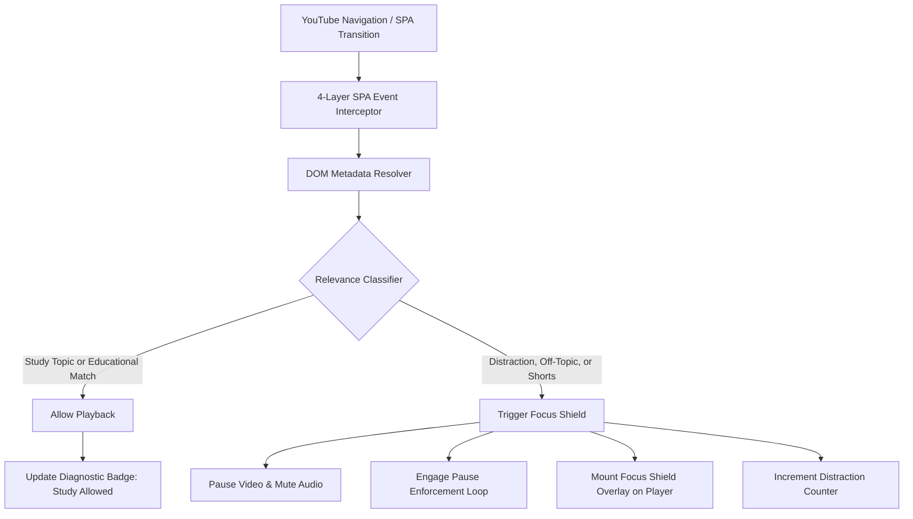

<div align="center">

# 🎓 FocusTube

### Intelligent Distraction-Control & Study Mode for YouTube
**Engineered for High-Stakes Exam Revision & Focused Academic Learning**

[](https://developer.chrome.com/docs/extensions/mv3/intro/)
[](https://developer.mozilla.org/en-US/docs/Web/JavaScript)
[](PRIVACY.md)
[](LICENSE)
[](https://nayanika530.github.io/focustube/)

<br />


<br />
<br />

**[🌐 Live Companion & Download Portal](https://nayanika530.github.io/focustube/)** • **[⚡ Quickstart Guide](#-quickstart-for-reviewers-30-second-setup)** • **[📐 System Architecture](#-system-architecture--engineering-deep-dive)** • **[💡 Design Rationale](#-why-its-built-this-way-technical-decisions--trade-offs)** • **[🔒 Privacy Policy](PRIVACY.md)**

---

</div>

## 📌 Executive Summary & Problem Statement

YouTube hosts some of the world's most valuable academic lecture material (MIT OCW, NPTEL, Stanford Engineering, GATE syllabus lectures). However, its recommendation algorithms are inherently optimized for **engagement, session-length, and ad-monetization**—not learning retention.

During high-stakes exam revision, students often experience cognitive fatigue. When navigating to YouTube for a specific computer science lecture or derivation, algorithmic recommendation rabbit holes (trending video game trailers, music releases, comedy sketches, and algorithmic Shorts) induce severe cognitive context switching.

**The Limitations of Existing Approaches:**
* **Generic URL Blockers** (Cold Turkey, Freedom, BlockSite): Take an all-or-nothing approach by blacklisting `youtube.com` entirely, cutting students off from essential educational lectures.
* **Ad Blockers**: Remove advertisements but leave the entire distraction-laden recommendation engine intact.

**FocusTube's Approach:**  
An on-device browser extension that operates inside YouTube's Single Page Application (SPA). FocusTube inspects dynamic video metadata, cross-references it against the student's active exam syllabus topics and academic heuristics, and raises an interactive **Focus Shield** that pauses and mutes non-study distractions before they hook the student's attention.

---

## 🚀 Key Features

* **🎯 Dynamic Syllabus-Aware Filtering:** Students specify their exam subjects (e.g., *Operating Systems, Memory Management, Calculus, Data Structures*). FocusTube inspects active video titles, channels, and descriptions for immediate relevance.
* **🛑 Playback Intercept & Focus Shield:** Pauses HTML5 `<video>` playback, suppresses auto-resuming, and renders a native dark-mode shield overlay with contextual rationale and one-click redirection to study searches.
* **🚫 YouTube Shorts Blocker:** Completely intercepts and locks the algorithmic `/shorts/` feed during active study sessions.
* **⚡ Single-Page Application (SPA) Resilience:** Handles YouTube's client-side navigation transitions without requiring full page reloads.
* **🔓 Academic Override Option:** Provides an override for niche educational documentaries or lectures with unconventional titles.
* **🔒 Local Execution:** All evaluation runs locally in the client browser with no external network dependencies or telemetry (see [PRIVACY.md](PRIVACY.md)).

---

## 📐 System Architecture & Engineering Deep-Dive

FocusTube is engineered to adhere strictly to **Chrome Extensions Manifest V3 (MV3)** while handling the asynchronous, component-driven client architecture of YouTube.



### Text Architecture Overview

```
[ User Navigates YouTube ]
           │
           ▼
[ 4-Layer SPA Interceptor ] ── (yt-navigate-finish, Navigation API, Title Observer, Polling)
           │
           ▼
[ DOM Metadata Resolver ] ──── (Extracts Video ID, Title, Channel from dynamic DOM)
           │
           ▼
[ Relevance Classifier ] ───── (Matches active topics & academic signals vs distraction taxonomy)
     ├── MATCH: Study Video ───► Allow Normal Playback + Green Badge
     └── MATCH: Distraction ───► Pause Video + Mute + Render Focus Shield Overlay
```

---

### 1. YouTube Single-Page Application (SPA) Interceptor

YouTube is not a traditional multi-page web application. It runs on a client-side framework built on **Polymer Web Components**. When a user clicks a video, the browser does not trigger `window.onload` or standard navigation lifecycle events; it performs an in-memory client transition via history pushState and XHR stream hydration.

To achieve transition reliability across different Chromium browsers, FocusTube implements a **4-layer event listener architecture**:

1. **Polymer Lifecycle Hooks:** Listens for YouTube's internal custom DOM events: `yt-navigate-finish` and `yt-page-data-updated`.
2. **Chromium Navigation API:** Utilizes `window.navigation.addEventListener('navigatesuccess')` supported in modern Chromium engines (Chrome 102+).
3. **Title MutationObserver:** Monitors character data and childList mutations on the document `<title>` element, which YouTube's internal router updates on transition.
4. **Safety Poller:** A 350ms tick fallback that guards against edge-case silent URL state mutations.

### 2. Handling Asynchronous DOM Hydration

On YouTube, the URL frequently updates milliseconds *before* the DOM tree hydrates the new video title and channel details. Querying the DOM synchronously upon navigation often yields either empty nodes or stale metadata from the previous video.

FocusTube handles this with an asynchronous retry resolver:
```javascript
// content.js - DOM Hydration Resolver with Timeout Fallback
function waitForVideoTitle(videoId, maxWaitMs = 5000) {
  const startTime = Date.now();
  
  function checkTitle() {
    if (getVideoId() !== videoId) return;

    const title = queryVideoTitleFromDOM();
    if (title) {
      checkAndFilterVideo(videoId, title);
      return;
    }

    if (Date.now() - startTime < maxWaitMs) {
      setTimeout(checkTitle, 150);
    } else {
      const fallbackTitle = document.title ? document.title.replace(/\s*-\s*YouTube$/, '').trim() : 'Unknown';
      checkAndFilterVideo(videoId, fallbackTitle);
    }
  }
  checkTitle();
}
```

### 3. Playback Intercept & Autoplay Loop Prevention

When an overlay is injected over `#movie_player`, YouTube's internal player scripts may attempt to resume playback or play audio in the background.

FocusTube implements an enforcement guard:
* **Immediate DOM Pause:** Invokes `.pause()` and sets `.muted = true` on the active HTML5 `<video>`.
* **Guard Loop (`enforceVideoPause`):** Runs an interval that monitors player state while the shield is active, suppressing autoplay triggers without interfering with native controls once unblocked.

---

## 💡 Why It's Built This Way: Technical Decisions & Trade-Offs

| Architecture Decision | Chosen Approach | Alternative Considered | Rationale & Trade-Off |
| :--- | :--- | :--- | :--- |
| **Relevance Classification Engine** | **Client-Side Heuristic & Keyword Taxonomy** | Cloud LLM API (e.g., OpenAI / Gemini API) | **Latency & Privacy:** Running heuristics locally on-device evaluates synchronously without adding network roundtrip delays. It also eliminates API operating costs and ensures zero user browsing history leaves the browser. |
| **Content Script Injection Layer** | **DOM Content Script Injection** | Chrome `declarativeNetRequest` | YouTube streams media segments via chunked DASH/HLS requests sharing common domain endpoints. Blocking network requests breaks YouTube entirely; DOM-level intervention enables selective pausing, Shorts blocking, and displaying an explanatory UI overlay. |
| **Settings Synchronization** | **`chrome.storage.local` + Direct Tab Messaging** | Background Service Worker polling | When settings change in `popup.js`, an event is emitted via `chrome.tabs.sendMessage` to active tabs, providing immediate updates without continuous background worker wake-ups. |
| **Distribution Strategy** | **Open Source GitHub + GitHub Pages Companion** | Chrome Web Store | Provides reviewers and students with direct access to unminified, auditable source code, step-by-step developer installation, and an interactive live simulator. |

---

## 📂 Project Structure

```
FocusTube/
├── extension/                  # Chrome Extension Source (Manifest V3)
│   ├── manifest.json           # Extension declaration, permissions, content script mappings
│   ├── content.js              # Core engine: SPA interceptor, relevance evaluator, Focus Shield
│   ├── popup.html              # Extension control center UI
│   ├── popup.css               # Control center dark glassmorphic styling
│   ├── popup.js                # State management and chrome.storage.local sync
│   └── icons/                  # Extension icons (16px, 32px, 48px, 128px)
│
├── docs/                       # GitHub Pages Companion Portal (Live at nayanika530.github.io/focustube)
│   ├── index.html              # Landing page with interactive on-page test-drive simulator
│   ├── style.css               # Dark-mode responsive design system
│   ├── app.js                  # Simulator state machine & ZIP download handler
│   ├── logo.svg                # Vector brand identity
│   ├── focustube-extension.zip # Packaged extension bundle for direct downloading
│   └── .nojekyll               # Disables Jekyll processing for raw static file serving
│
├── assets/                     # Documentation Assets
│   ├── demo.gif                # Animated demonstration of the Focus Shield
│   ├── demo.webp               # Full-fidelity animated recording
│   └── icons/                  # Master project icons
│
├── PRIVACY.md                  # Detailed permissions, storage, and zero-telemetry policy
├── README.md                   # Technical specification & architecture documentation
└── LICENSE                     # MIT Open Source License
```

---

## ⚡ Quickstart for Reviewers: 30-Second Setup

Reviewers can test FocusTube in any Chromium browser (Google Chrome, Microsoft Edge, Brave, Opera):

1. **Clone or Download the Repository:**
   ```bash
   git clone https://github.com/Nayanika530/focustube.git
   ```
   *(Or download [`focustube-extension.zip`](docs/focustube-extension.zip) and extract it).*

2. **Open Extensions Management:**
   * Navigate to `chrome://extensions` (or `edge://extensions` in Microsoft Edge).
   * Enable the **"Developer mode"** toggle in the top-right corner.

3. **Load the Extension:**
   * Click **"Load unpacked"** in the top-left corner.
   * Select the `extension/` folder in this repository.

4. **Verify on YouTube:**
   * Visit an academic lecture (e.g. search for *Operating Systems Memory Management*): The video plays smoothly with a green diagnostic indicator.
   * Visit a non-study video (e.g. search for any *official music video* or *gaming trailer*): The video is paused and locked by the **Focus Shield**.
   * Click the FocusTube icon in your toolbar to customize study topics or toggle modes.

---

## 🔒 Privacy & Data Handling

FocusTube runs entirely on-device:
* All settings and study topics are stored solely in `chrome.storage.local`.
* No remote analytics, telemetry endpoints, or third-party trackers are included.
* For the complete policy, see [PRIVACY.md](PRIVACY.md).

---

## 📄 License

This project is licensed under the **MIT License** — see [LICENSE](LICENSE) for details.
